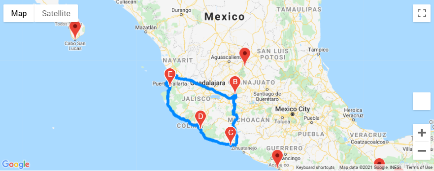
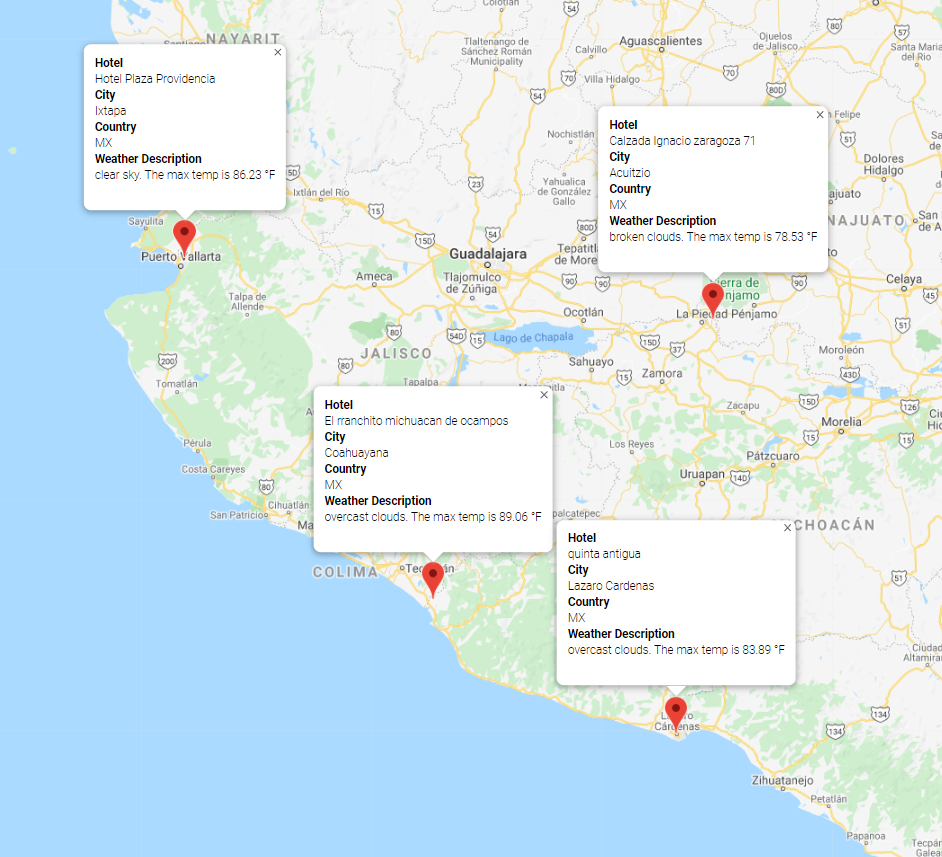

# World_Weather_Analysis
This program will generate any given number of Latitude/Longitute pairs and from there find the closest cities to the random pairs. It will then compile weather data on all cities located using this method. Program than prompts user for input of a minimum and maximum temperature from which to narrow the search of cities. It also has functionality to create a travel map of selected cities on the itinerary.

